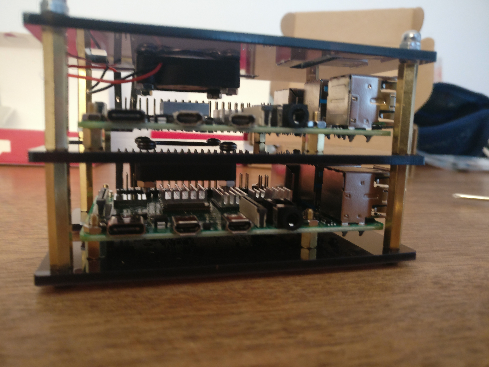

# Samsja-cloud infrastructure

This project is the configuration files of my home based self hosted Cloud : **samsja-cloud**. It is composed of two Raspberry pi 4 ( 4gb of ram). I am running a kubernetes (k8s) cluster on it ([k3s rancher distribution](https://k3s.io/)).

 The service I am heberging:

 * My personnal [website](https://home.samsja.fr)

 * [Keycloak](https://www.keycloak.org/) as the authentification and user management application
 * [NextCloud](https://nextcloud.com/) as google drive (and docs and agenda) alternative
 * [Piwigo](https://piwigo.org/) as a google photos alternative

 WIP :

 * (Jitsi)[https://meet.jit.si/] as a zoom alternative
 * (Mattermost)[https://meet.jit.si/] as a slack alternative
 * gitlab
 * container registery

 and other ...
